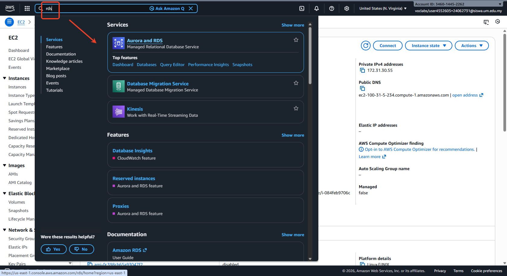
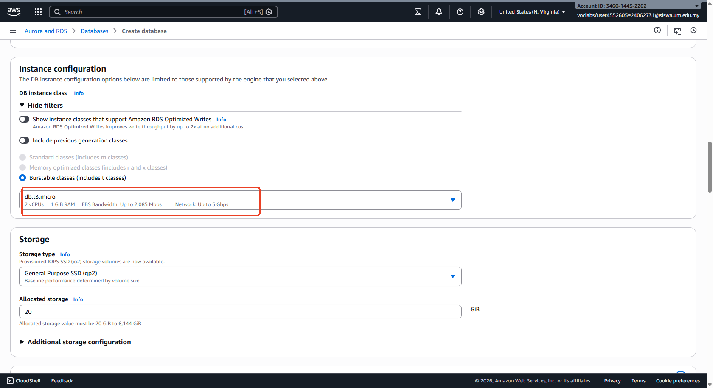
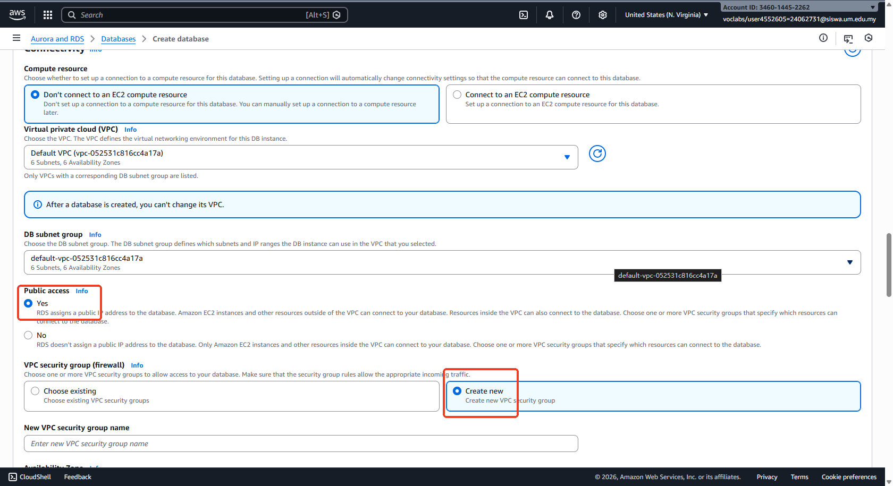
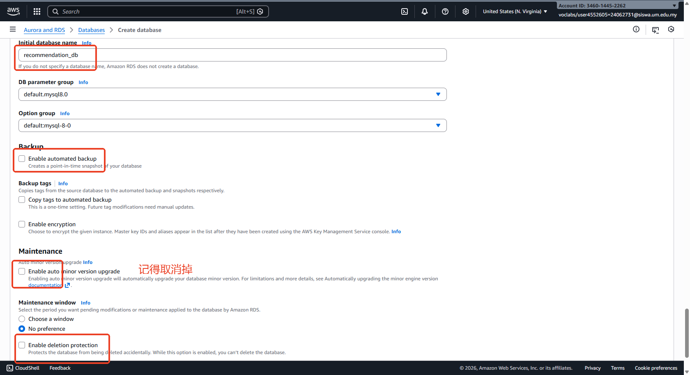
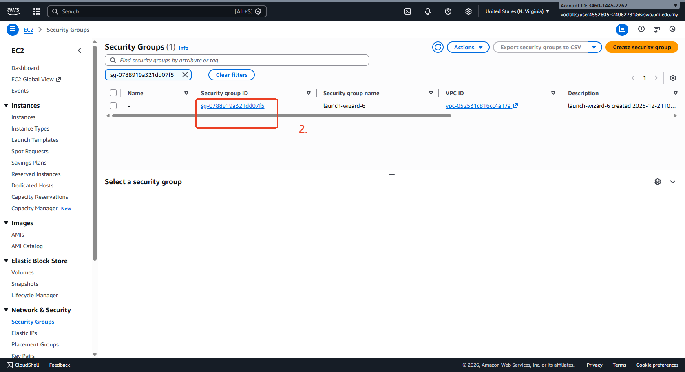
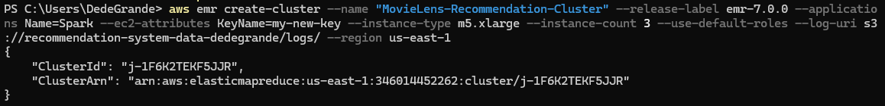
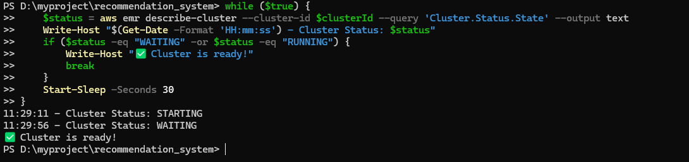
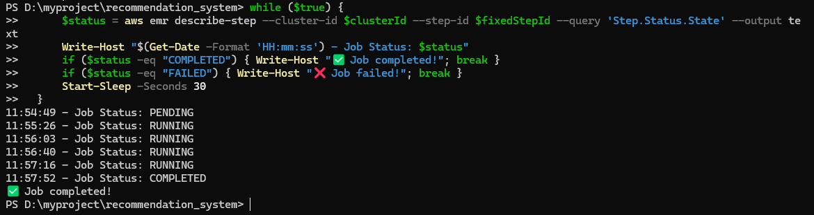
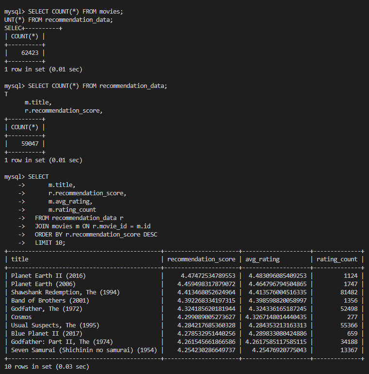
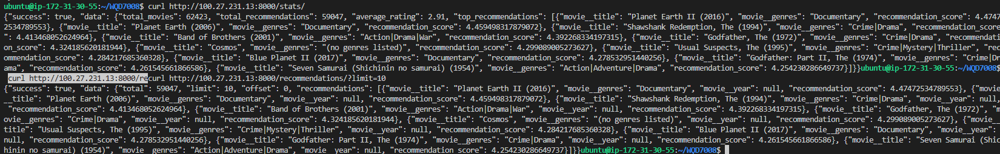

# 完整部署指南 - AWS MovieLens 推荐系统

本文档记录了从零开始在 AWS 上部署 MovieLens 推荐系统的完整步骤。

---

## 前置条件

- AWS 账号（AWS Academy 或普通账号）
- 本地已安装：Git、AWS CLI、SSH 客户端
- 已创建：RDS 数据库、S3 存储桶

### 关键信息

| 资源 | 值 |
|------|-----|
| **RDS 端点** | recommendation-db.croqeqgd3egv.us-east-1.rds.amazonaws.com |
| **数据库名** | recommendation_db |
| **数据库用户** | admin |
| **数据库密码** | RecommendDB2026! |
| **S3 存储桶** | recommendation-system-data-dedegrande |
| **区域** | us-east-1 |

---

## 第一部分：本地准备

### 1. 配置 AWS CLI（先得在本地下载好）

**Windows PowerShell：**

```powershell
# 配置 AWS 凭证
aws configure

# 输入：
# AWS Access Key ID: [你的密钥]
# AWS Secret Access Key: [你的密钥]
# Default region name: us-east-1
# Default output format: json

# 验证配置
aws sts get-caller-identity
```


**AWS Academy 用户：**

```powershell
# 打开凭证文件
notepad $env:USERPROFILE\.aws\credentials

# 粘贴从 AWS Academy "AWS Details" 获取的凭证：
# [default]
# aws_access_key_id=ASIA...
# aws_secret_access_key=...
# aws_session_token=...
```

---

### 2. 创建 EC2 SSH 密钥对（在本地poweshell，这一步本地如果只想用chrome打开实例的话本地终端不连接可以略过）

```powershell
# 进入 .ssh 目录
cd ~/.ssh

# 创建密钥对（使用正确编码）
aws ec2 create-key-pair --key-name my-new-key --query 'KeyMaterial' --output text | Out-File -Encoding ASCII -FilePath my-new-key.pem

# 提取公钥（保存输出，稍后需要）
ssh-keygen -y -f my-new-key.pem

# 设置权限
icacls my-new-key.pem /inheritance:r
icacls my-new-key.pem /grant $env:USERNAME:R
```

---

### 3. 上传数据到 S3

```powershell
# 进入项目目录
cd D:\myproject\recommendation_system

# 上传 CSV 数据文件
aws s3 cp data/movies.csv s3://recommendation-system-data-dedegrande/input/
aws s3 cp data/ratings.csv s3://recommendation-system-data-dedegrande/input/

# 上传 Spark 脚本
aws s3 cp spark_recommendation.py s3://recommendation-system-data-dedegrande/scripts/


# 验证上传
aws s3 ls s3://recommendation-system-data-dedegrande/ --recursive
```

```powershell
#将s3数据导入ec2 实例，ec2 控制台上执行
aws s3 sync s3://recommendation-system-data-dedegrande/input/ ~/WQD7008/data/

```

---

## 第二部分：EC2 部署

### 4. 启动并连接 EC2

#### 4.1 创建 EC2 实例（控制台）

1. AWS 控制台 → EC2 → 启动实例
2. 配置：
   - **名称**: MovieLens-Server
   - **AMI**: Ubuntu Server 22.04 LTS
   - **实例类型**: t2.micro 或 t3.small
   - **密钥对**: my-new-key
   - **安全组**: 允许 SSH (22)、HTTP (8000)

#### 4.2 添加公钥到 EC2（4.2和4.3本地如果只想用chrome打开实例的话，本地终端不连接可以略过）

**通过 EC2 Instance Connect（浏览器）：**

1. EC2 控制台 → 实例 → 连接 → EC2 Instance Connect
2. 在终端执行：

```bash
# 添加你的公钥（替换为步骤2提取的公钥）
echo "ssh-rsa AAAAB3NzaC1yc2EAAAADAQABAAABAQC0HSP..." >> ~/.ssh/authorized_keys
chmod 600 ~/.ssh/authorized_keys
```

#### 4.3 本地 SSH 连接

```powershell
# 查看 EC2 公网 IP
aws ec2 describe-instances --filters "Name=instance-state-name,Values=running" --query "Reservations[*].Instances[*].PublicIpAddress" --output text

# SSH 连接（用户名是 ubuntu）
ssh -i ~/.ssh/my-new-key.pem ubuntu@<EC2公网IP>
```

---

### 5. 安装必要工具

**在 EC2 SSH 终端执行：**

```bash
# 更新系统
sudo apt update

# 安装必要工具
sudo apt install -y git python3 python3-pip python3-venv python3-dev \
  libmysqlclient-dev build-essential mysql-client pkg-config \
  default-libmysqlclient-dev
```

---

### 6. 克隆 GitHub 项目（在EC2 终端执行）

```bash
# 进入主目录
cd ~

# 克隆项目（替换为你的 GitHub 仓库）
git clone https://github.com/DedeGrande001/WQD7008.git

# 进入项目目录
cd WQD7008

# 查看文件
ls -la
```

---

### 7. 配置 Python 环境

```bash
# 创建虚拟环境
python3 -m venv venv

# 激活虚拟环境
source venv/bin/activate

# 升级 pip
pip install --upgrade pip

# 安装依赖
pip install -r requirements.txt
```

---

### 8. 配置环境变量

```bash
# 创建 .env 文件
nano .env
```

**粘贴以下内容：**

```env
DB_NAME=recommendation_db
DB_USER=admin
DB_PASSWORD=RecommendDB2026!
DB_HOST=recommendation-db.croqeqgd3egv.us-east-1.rds.amazonaws.com
DB_PORT=3306
SECRET_KEY=django-insecure-movie-recommendation-dev-key-2024
DEBUG=False
```

按 `Ctrl+X`，`Y`，`Enter` 保存。

---

### 9. 测试数据库连接
#### 这里要先创建一个数据库



 
 
 
 

#### 数据库创建完成后，需要去security group创建一个inbound rules
 
 
 


```bash
# 测试 MySQL 连接
mysql -h recommendation-db.croqeqgd3egv.us-east-1.rds.amazonaws.com \
      -u admin \
      -p \
      recommendation_db
# 数据库清除表命令
mysql -h recommendation-db.croqeqgd3egv.us-east-1.rds.amazonaws.com -u admin -pRecommendDB2026! recommendation_db -e "SET FOREIGN_KEY_CHECKS=0; TRUNCATE TABLE recommendation_data; TRUNCATE TABLE movies; SET FOREIGN_KEY_CHECKS=1;"
# 输入密码：RecommendDB2026!
# 连接成功后输入 exit 退出
```

---

### 10. 运行数据库迁移

```bash
# 确保虚拟环境已激活
source venv/bin/activate

# 运行迁移，创建数据库表
python manage.py migrate
```

**预期输出：**
```
Applying contenttypes.0001_initial... OK
Applying auth.0001_initial... OK
Applying app.0001_initial... OK
...
```

---

### 11. 启动 Django 服务

```bash
# 后台启动 Django
nohup python manage.py runserver 0.0.0.0:8000 > django.log 2>&1 &

# 查看进程
ps aux | grep runserver

# 查看日志
tail -f django.log
```

**按 `Ctrl+C` 停止查看日志（服务继续运行）**

---

### 11.5 运行 Spark 数据处理（EC2 控制台）

**安装 Java 17：**

```bash
# 安装 Java 17（PySpark 已包含在 requirements.txt）
sudo apt install -y openjdk-17-jdk

# 设置 JAVA_HOME
export JAVA_HOME=/usr/lib/jvm/java-17-openjdk-amd64
```

**下载 S3 数据到本地（如果尚未下载）：**

```bash
# 确保 data 目录存在
mkdir -p ~/WQD7008/data

# 从 S3 下载 CSV 文件
aws s3 sync s3://recommendation-system-data-dedegrande/input/ ~/WQD7008/data/
```

**运行 Spark 推荐脚本：（EC2 控制台）**

```bash
# 激活虚拟环境
cd ~/WQD7008
source venv/bin/activate

# 清空现有数据（可选）
python manage.py shell -c "from app.models import Movie, RecommendationData; RecommendationData.objects.all().delete(); Movie.objects.all().delete(); print('Database cleared')"

# 运行 Spark 脚本（处理 100 部电影）
export JAVA_HOME=/usr/lib/jvm/java-17-openjdk-amd64
python spark_recommendation.py

# 查看输出
# 预期：
# - Loaded 100 movies
# - Loaded 804712 ratings
# - Job completed successfully!
```

**验证数据写入：**

```bash
python manage.py shell -c "from app.models import Movie, RecommendationData; print(f'Movies: {Movie.objects.count()}'); print(f'Recommendations: {RecommendationData.objects.count()}')"
```

**预期输出：**
```
Movies: 100
Recommendations: 100
```

---

### 12. 配置 EC2 安全组

**AWS 控制台：**

1. EC2 → 安全组 → 选择你的 EC2 安全组
2. 编辑入站规则 → 添加规则：
   - **类型**: 自定义 TCP
   - **端口**: 8000
   - **源**: 0.0.0.0/0

---

### 13. 测试 API 访问

**本地浏览器访问：**

- `http://<EC2公网IP>:8000/health/`
- `http://<EC2公网IP>:8000/stats/`

**或 PowerShell 测试：**

```powershell
curl http://<EC2公网IP>:8000/health/
```

**预期返回：**
```json
{
    "status": "healthy",
    "service": "recommendation-system",
    "message": "System is running"
}
```

---

## 第三部分：EMR 数据处理

### 14. 配置 RDS 安全组

**允许 EMR 访问 RDS：**

1. AWS 控制台 → RDS → 数据库 → recommendation-db
2. VPC 安全组 → 编辑入站规则 → 添加规则：
   - **类型**: MySQL/Aurora
   - **端口**: 3306
   - **源**: 0.0.0.0/0（测试用）或 EMR 安全组

---

### 15. 创建 EMR 集群

**PowerShell 执行（一行命令）：**

```powershell
aws emr create-cluster --name "MovieLens-Recommendation-Cluster" --release-label emr-7.0.0 --applications Name=Spark --ec2-attributes KeyName=my-new-key --instance-type m5.xlarge --instance-count 3 --use-default-roles --log-uri s3://recommendation-system-data-dedegrande/logs/ --region us-east-1
```

**保存返回的 Cluster ID：** `j-xxxxxxxxxxxxx`


---

### 16. 等待集群启动

```powershell
# 替换为你的 Cluster ID
$clusterId = "j-xxxxxxxxxxxxx"

# 监控状态（每30秒检查一次）
while ($true) {
    $status = aws emr describe-cluster --cluster-id $clusterId --query 'Cluster.Status.State' --output text
    Write-Host "$(Get-Date -Format 'HH:mm:ss') - Cluster Status: $status"
    if ($status -eq "WAITING" -or $status -eq "RUNNING") {
        Write-Host "✅ Cluster is ready!"
        break
    }
    Start-Sleep -Seconds 30
}
```



**预计需要 5-10 分钟**

---

### 17. 提交 Spark 作业

**集群状态变为 WAITING 后执行：**

```powershell
'[{"Type":"Spark","Name":"MovieLens-Processing","ActionOnFailure":"CONTINUE","Args":["spark-submit","--deploy-mode","cluster","--packages","mysql:mysql-connector-java:8.0.33,org.apache.hadoop:hadoop-aws:3.3.2,com.amazonaws:aws-java-sdk-bundle:1.11.1026","s3://recommendation-system-data-dedegrande/scripts/spark_recommendation.py","s3://recommendation-system-data-dedegrande/input","recommendation-db.croqeqgd3egv.us-east-1.rds.amazonaws.com","recommendation_db","admin","RecommendDB2026!"]}]' | Out-File -Encoding ASCII steps.json

# 替换为你的 Cluster ID
aws emr add-steps --cluster-id j-xxxxxxxxxxxxx --steps file://steps.json
```

**说明：**
- `spark_recommendation.py` 支持本地和 EMR 两种模式
- 本地模式（EC2）：不带参数运行，处理 100 部电影避免资源耗尽
- EMR 模式：传入 5 个参数（S3路径、RDS配置），处理完整数据集

**保存返回的 Step ID：** `s-xxxxxxxxxxxxx`

---

### 18. 监控作业进度

```powershell
# 替换为你的 Cluster ID 和 Step ID
$clusterId = "j-xxxxxxxxxxxxx"
$stepId = "s-xxxxxxxxxxxxx"

# 监控作业状态
while ($true) {
    $status = aws emr describe-step --cluster-id $clusterId --step-id $stepId --query 'Step.Status.State' --output text
    Write-Host "$(Get-Date -Format 'HH:mm:ss') - Job Status: $status"
    if ($status -eq "COMPLETED") {
        Write-Host "✅ Job completed successfully!"
        break
    }
    if ($status -eq "FAILED") {
        Write-Host "❌ Job failed!"
        break
    }
    Start-Sleep -Seconds 30
}
```


#### 查看emr日志
```powershell
# 列出该Step的所有日志
aws s3 ls s3://recommendation-system-data-dedegrande/logs/$clusterId/steps/$newStepId/stderr.gz

# 下载stderr日志
aws s3 cp s3://recommendation-system-data-dedegrande/logs/$clusterId/steps/$newStepId/stderr.gz ./

# 解压并查看（Windows）
powershell -command "& { [System.IO.Compression.GZipStream]::new([System.IO.File]::OpenRead('stderr.gz'), [System.IO.Compression.CompressionMode]::Decompress).CopyTo([System.IO.File]::Create('stderr.log')) }"

# 查看日志
Get-Content stderr.log -Tail 50
```

---

## 第四部分：验证与清理

### 19. 验证数据写入 RDS

**在 EC2 SSH 终端：**

```bash
# 连接到 RDS
mysql -h recommendation-db.croqeqgd3egv.us-east-1.rds.amazonaws.com \
      -u admin \
      -p \
      recommendation_db

# 输入密码后，在 MySQL shell 执行：
SELECT COUNT(*) FROM movies;
SELECT COUNT(*) FROM recommendation_data;
SELECT
      m.title,
      r.recommendation_score,
      m.avg_rating,
      m.rating_count
  FROM recommendation_data r
  JOIN movies m ON r.movie_id = m.id
  ORDER BY r.recommendation_score DESC
  LIMIT 10;

# 退出
exit
```

---

### 20. 测试 API 返回推荐数据

**EC2 控制台输入：**

```powershell
# 确认Django服务正在运行
curl http://100.27.231.13:8000/stats/

curl http://100.27.231.13:8000/recommendations/?limit=10

```
**预期返回：**
```json
{
    "success": true,
    "data": {
        "total_movies": 10312,
        "total_recommendations": 10312,
        "average_rating": 3.3,
        "top_recommendations": [...]
    }
}
```

---

### 21. 终止 EMR 集群

```powershell
# 终止集群
aws emr terminate-clusters --cluster-ids j-xxxxxxxxxxxxx

# 验证集群已终止
aws emr describe-cluster --cluster-id j-xxxxxxxxxxxxx --query 'Cluster.Status.State' --output text
```

**预期返回：** `TERMINATING` 或 `TERMINATED`

---

## 架构图

```
┌─────────────┐
│   用户请求   │
└──────┬──────┘
       │
       ↓
┌─────────────────┐
│  EC2 (Django)   │  ← API 服务
│  Port: 8000     │
└────────┬────────┘
         │
         ↓
┌─────────────────┐
│  RDS (MySQL)    │  ← 存储推荐数据
│  Port: 3306     │
└────────┬────────┘
         ↑
         │
┌─────────────────┐
│  EMR (Spark)    │  ← 数据处理
│  读取 S3 数据   │
└────────┬────────┘
         │
         ↓
┌─────────────────┐
│  S3 Bucket      │  ← 数据存储
│  - movies.csv   │
│  - ratings.csv  │
│  - scripts/     │
└─────────────────┘
```

---
